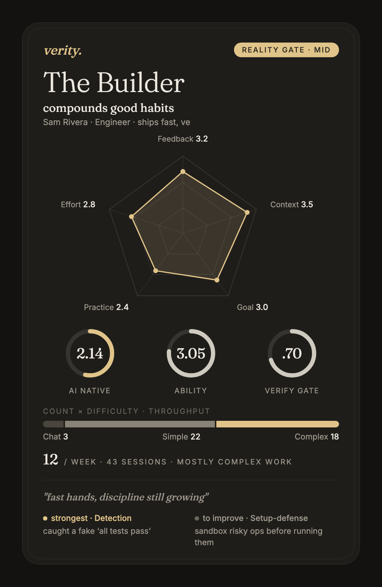

# ai-proficiency-eval

**See how you _actually_ build with AI — fairly, locally, and in plain language.**

A small, open, fully-local tool that reads your AI coding/work sessions (Claude Code, Cursor, Codex, …) and produces a fair, auditable "proficiency card" plus concrete feedback on how to improve. No data ever goes to a third-party server.

<p align="center">
  
</p>

> Above: the shareable "stat card" — a **synthetic** example. What sets it apart from activity dashboards is that every number traces back to a real quote from the sessions. Here the strongest dimension, **Detection (3.4)**, is backed by _"caught a fake 'all tests pass'"_; the top growth area, **Setup-defense (2.2)**, by _"ran a migration unverified."_ There's also a longer detailed card per person (per-dimension evidence, strengths, growth, top-3 fixes).

---

## The problem

Everyone wants to be "AI-native." Almost nobody can say what that means, measure it, or tell you how to get better.

- A manager asks "is this person using AI well?" — and answers from gut feel.
- An engineer asks "am I improving?" — and has no signal at all.
- The closed cloud tools that promise to profile you want to upload your **code, git history, and prompts** to their servers — a non-starter for anyone with sensitive or proprietary work. (YC's Paxel is the prominent example; despite "your code stays local" claims, researchers found it uploading code excerpts, git metadata, and prompt text. Even setting the leak aside, you can't audit a closed scoring model, and you can't run it on a private codebase in good conscience.)

This tool is the opposite: **local, auditable, and opinionated about what actually makes someone good with AI.**

## What it does

Point it at your session logs. It:

1. Compacts each session into a clean trace and auto-computes your volume / difficulty mix / throughput.
2. Scores each task on 19 dimensions (0–4) with a **real quote behind every score**, using a multi-agent Claude Code workflow.
3. Renders two cards per person:
   - a **detailed card** — per-dimension evidence, strengths, growth areas, top-3 fixes;
   - a shareable **stat card** — radar + gauges + your archetype (e.g. "The Verifier").

## Why it's different — three principles

These are the calibration that took dozens of iterations to get right. They're also why the score means something.

1. **Only score what you control.** You influence an AI through exactly two levers: what you put in up front (facts, goal, constraints, tool choice) and how you correct it (catching fake "done", steering it back). The model's autonomous behavior — fanning out agents, thrashing, hallucinating — is **never** charged to you; it's only evidence about whether your input invited it and whether you caught it. **Process volume (tokens, lines/hour, number of agents, prompt length) is an anti-indicator and is never scored.** High volume usually means low efficiency.

2. **Per-task, with receipts.** One session is many tasks; they're split and scored individually, and every judgment is pinned to a real quote you can click back to. No vibes, no aggregate hand-waving.

3. **Gate × ability × leverage — bucket, don't rank.** The headline is a **verification gate**: did you actually check against reality, or did you accept "the tests passed"? It's a multiplier, not an addend — if your output isn't trustworthy, nothing else compensates. This is exactly the signal that activity-counting profilers miss: they'll happily give a high score to a confident run that shipped unverified, broken code.

## Privacy

- **Local.** It reads session files already on your machine. There is no third-party upload, no account, no token.
- **Same trust boundary you already accept.** The only network calls are to the LLM provider you configure — the same one your coding agent already talks to.
- **Auditable.** It's a handful of scripts and a rubric you can read top to bottom. The scoring model isn't a black box.

## Install & run

Requires **Claude Code** (the per-task scoring runs as a multi-agent Claude Code Workflow), plus `python3` and `node`.

**1. Install** — clone it straight into your Claude Code skills folder:

```bash
git clone https://github.com/fafawlf/ai-proficiency-eval.git ~/.claude/skills/ai-proficiency-eval
```

**2. Point it at your sessions** — edit `config.json`:
- `sources` — globs for your session logs (default `~/.claude/projects/*/*.jsonl`), each tagged with a `person` and `tool`. **This is the "reads all your sessions" step: it ingests every session matching the glob — entirely on your machine, nothing uploaded.**
- `canon` — merge one person's multiple machines/accounts into a single identity.
- `people` — display names / roles.

**3. Run it — easiest way: just ask Claude.** Since it's now a skill, in Claude Code say:

> "Evaluate my AI proficiency with the ai-proficiency-eval skill."

Claude runs the whole pipeline for you — compaction, the multi-agent scoring Workflow, and rendering — and writes the cards to `cards/`.

**Or run the scripts yourself:**

```bash
python3 scripts/compact_sessions.py      # 1. read your sessions → clean traces + auto count/difficulty/throughput
# 2. score each task — run scripts/score_workflow.mjs as a Claude Code Workflow.
#    (This is the step that needs Claude Code; the "just ask Claude" path above does it for you.)
python3 scripts/render_cards.py          # 3a. detailed card        → cards/<person>.html
python3 scripts/render_stat_card.py      # 3b. shareable stat card  → cards/<person>_stat.html
```

Full method and per-dimension anchors: [`reference/rubric.md`](reference/rubric.md). Pipeline detail: [`SKILL.md`](SKILL.md).

## Limitations (please read)

- **0–4 is judged by an LLM.** For high-stakes or compensation decisions, add a second independent reader and have a human review every low gate score by hand.
- **Buckets, not decimal ranks.** A 0.1 gap is noise. Don't cross-compare across domains (a backend "run the tests" ≠ an analyst "re-run the SQL" ≠ HR "human sign-off").
- **You need sessions.** If you use AI in ways that don't leave a log, the tool can't see you. It also needs some weak/failure samples in the pool, or everyone clusters mid-high and there's no separation.
- **It measures how well you _use_ AI, not the business value of the output.**

## Status & contributing

Early and opinionated — it was built for real internal use and then scrubbed for release. PRs very welcome, especially:
- session-format adapters (Cursor / Codex / Gemini / OpenCode / other agents),
- rubric calibration and second-reader tooling.

## License

MIT — see [`LICENSE`](LICENSE).
